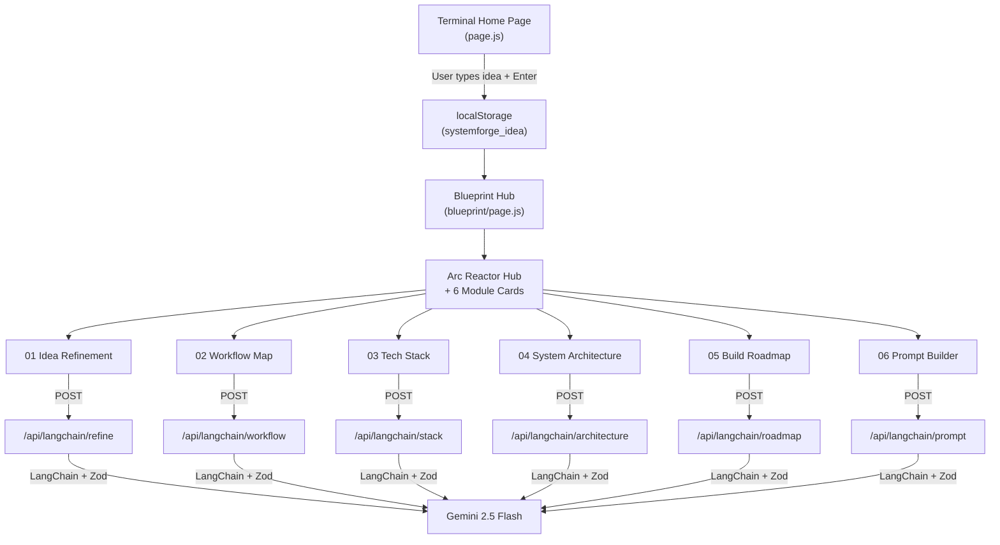

# SystemForge — Codebase Overview & Core Features

## Latest Changes (Git History)

| Commit | Description |
|--------|-------------|
| `79af52c` | Updated the central hub visual (arc reactor) |
| `d89f2b0` | Updated the centre visual design |
| `723590c` | Added localStorage caching for faster responses, new [TechStack](file:///c:/Users/rizan/Documents/Workspace/systemforge/src/components/TechStack.jsx#54-245) component |
| `e456042` | Upgraded blueprint page & refinement module |
| `7895e05` | Cleaned the home page |
| `573df53` | Integrated LangChain for AI features |

> [!IMPORTANT]
> The most recent work focused on: **replacing the atom animation with an arc reactor hub**, adding **localStorage caching**, and migrating from raw Gemini API calls to **LangChain with structured output (Zod schemas)**.

---

## Architecture Overview

---

## How Each Core Feature Works

### 1. Terminal Home Page — [page.js](file:///c:/Users/rizan/Documents/Workspace/systemforge/src/app/page.js)

- **Boot Sequence Animation**: Simulates a terminal bootup by typing out 4 lines character-by-character (28ms per char, 180ms per line pause)
- **Custom Cursor**: Uses a hidden `<input>` to capture keystrokes while rendering a visual terminal cursor via `` elements. Supports click-to-position via `document.caretRangeFromPoint`
- **Submission**: On `Enter`, the idea is saved to `localStorage("systemforge_idea")`, a "LOADING BLUEPRINT" animation plays for 1.2s, then the user is routed to `/blueprint`
- **Guidance Panel**: Side panel with product description, prompt tips, and quick-fill example buttons

### 2. Blueprint Hub — [blueprint/page.js](file:///c:/Users/rizan/Documents/Workspace/systemforge/src/app/blueprint/page.js)

- **Hub-and-Spoke Layout**: 6 module cards positioned absolutely (via `%` coordinates), connected to a central hub via SVG lines that are dynamically computed from DOM measurements
- **Arc Reactor Animation** ([Hub2D](file:///c:/Users/rizan/Documents/Workspace/systemforge/src/app/blueprint/page.js#327-515) component):
  - **10 trapezoidal coils** rotating at 20s/revolution
  - **Glowing channel ring** counter-rotating at 15s
  - **Dashed mid-ring** spinning at 8s
  - **Inner ring** with orbiting dots at 10s (counter-spin)
  - **Pulsing core** with radial gradient and multi-layered box-shadows
- **Module Selection**: Clicking a "READY" card swaps the hub for a [ModulePanel](file:///c:/Users/rizan/Documents/Workspace/systemforge/src/app/blueprint/page.js#571-600) containing the component
- **Visual Elements**: Ruler scales, corner markers, L-shaped workspace indicator, blueprint grid background

### 3. Idea Refinement — [IdeaRefinement.jsx](file:///c:/Users/rizan/Documents/Workspace/systemforge/src/components/IdeaRefinement.jsx)

**How it works:**
1. The raw idea is sent to `POST /api/langchain/refine`
2. The API uses **LangChain** with `ChatGoogleGenerativeAI` (Gemini 2.5 Flash) + `StructuredOutputParser` with a **Zod schema** to guarantee structured JSON output
3. The schema enforces: `productName`, `description`, `targetUsers[]`, `coreFeatures[]`, and `architectAdvice[]` (trade-off branches like SCALE vs SPEED)
4. **Conversation memory**: The component maintains a `history[]` of `{role, content}` messages, sent back to the API on each iteration for context-aware refinement
5. Users can provide **feedback** to iteratively regenerate, or click an "Architect Advice" card to pre-fill feedback
6. The refined concept can be **saved** to `localStorage`, which broadcasts a `CustomEvent` to all other modules

### 4. Tech Stack — [TechStack.jsx](file:///c:/Users/rizan/Documents/Workspace/systemforge/src/components/TechStack.jsx)

**How it works:**
1. Checks for a **cached result** in `localStorage(sf_cache_stack)` first
2. If no cache, sends the product context to `POST /api/langchain/stack`
3. API uses Zod schema to enforce: `recommendations[]` (2-4 stacks, each with `stackName`, `frontend`, `backend`, `database`, `whyPreferred`, `isPrimary`) + `summaryMotive`
4. Renders as cards with the primary stack highlighted in blue
5. Listens for `systemforge_refinement_updated` events → clears cache and re-analyzes

### 5. Workflow Map — [WorkflowMap.jsx](file:///c:/Users/rizan/Documents/Workspace/systemforge/src/components/WorkflowMap.jsx)

- Generates **React Flow** compatible JSON (nodes + edges) representing the user journey
- Prompts Gemini to create stages: Onboarding → Core Actions → Support Actions → Exit Paths
- Renders as an interactive node-based diagram

### 6. System Architecture — [SystemArchitecture.jsx](file:///c:/Users/rizan/Documents/Workspace/systemforge/src/components/SystemArchitecture.jsx)

- Generates a **PRD** (Problem Statement, Target Users, Core Features, Success Metrics) + a **React Flow architecture diagram** showing system layers (Frontend, Backend, Database)
- Both are returned in a single JSON response

### 7. Build Roadmap — [BuildRoadmap.jsx](file:///c:/Users/rizan/Documents/Workspace/systemforge/src/components/BuildRoadmap.jsx)

- Generates a phased development plan with: stages, descriptions, tasks, **terminal commands**, and **AI prompts** (copy-paste prompts for Cursor/IDE)
- Returned as a JSON array of stage objects

### 8. Prompt Builder — [PromptBuilder.jsx](file:///c:/Users/rizan/Documents/Workspace/systemforge/src/components/PromptBuilder.jsx)

- Synthesizes the entire blueprint into **3-4 phased "super prompts"** designed for AI coding assistants
- Each phase includes: `phaseName`, `targetAi` (e.g. "Cursor Composer"), `pasteInstructions`, and the full `promptText`

---

## State Management — [context.js](file:///c:/Users/rizan/Documents/Workspace/systemforge/src/lib/context.js)

The app uses **localStorage + CustomEvents** as a lightweight state bus:

| Key | Purpose |
|-----|---------|
| `systemforge_idea` | Raw user input from the terminal |
| `systemforge_refined_idea` | Structured JSON from Idea Refinement |
| `sf_cache_stack` | Cached Tech Stack results |
| `sf_cache_roadmap` | Cached Build Roadmap |
| `sf_cache_arch` | Cached System Architecture |
| `sf_cache_workflow` | Cached Workflow Map |
| `sf_cache_prompt` | Cached Prompt Builder |

When [saveRefinedConcept()](file:///c:/Users/rizan/Documents/Workspace/systemforge/src/lib/context.js#40-56) is called, it **clears all module caches** and dispatches `systemforge_refinement_updated`, causing all modules to re-fetch with the updated context.

---

## AI Integration Layer

Two parallel AI integration paths exist:

| Layer | Used By | Pattern |
|-------|---------|---------|
| **LangChain** (primary) | All 6 modules via `/api/langchain/*` routes | `ChatGoogleGenerativeAI` → `PromptTemplate` → `StructuredOutputParser` (Zod) |
| **Raw Gemini** (legacy) | [gemini.js](file:///c:/Users/rizan/Documents/Workspace/systemforge/src/lib/gemini.js) via `/api/gemini` | Direct prompt → text response with regex parsing |

> [!NOTE]
> The LangChain integration is the **current active path**. It uses Zod schemas to guarantee structured JSON responses, eliminating the fragile regex parsing from the legacy [gemini.js](file:///c:/Users/rizan/Documents/Workspace/systemforge/src/lib/gemini.js) approach. The legacy layer still exists in the codebase but the components now call `/api/langchain/*` endpoints.
